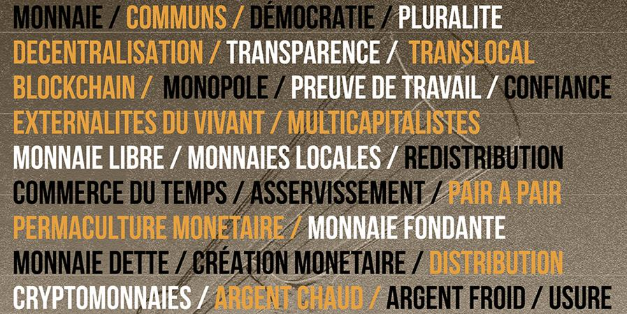
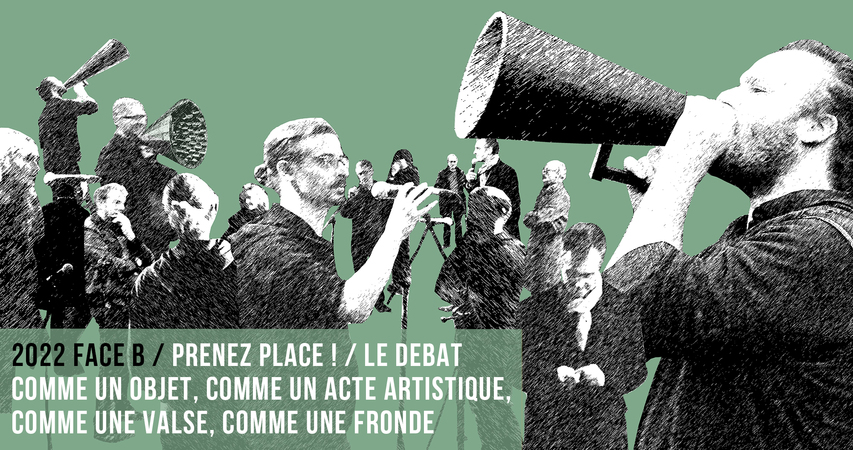
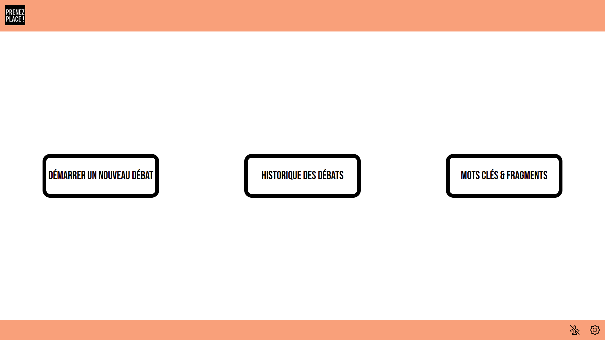
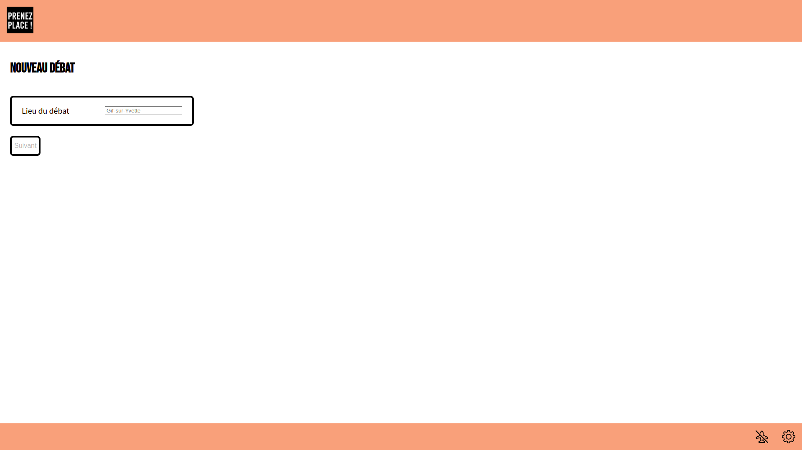
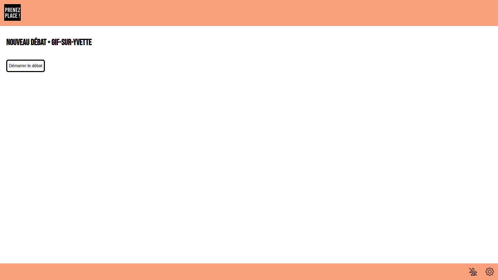
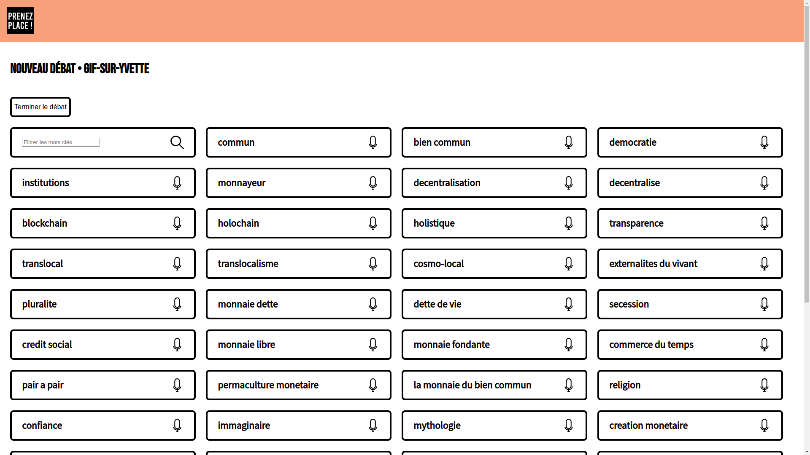
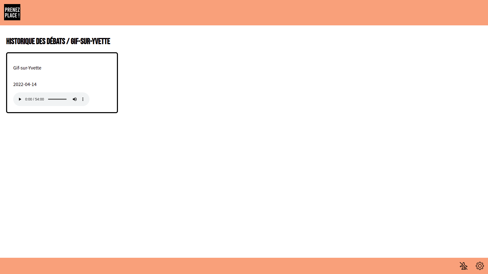
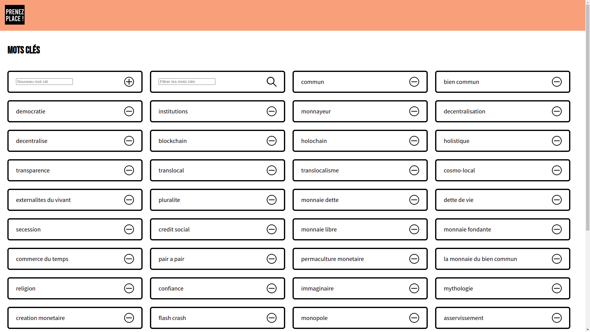
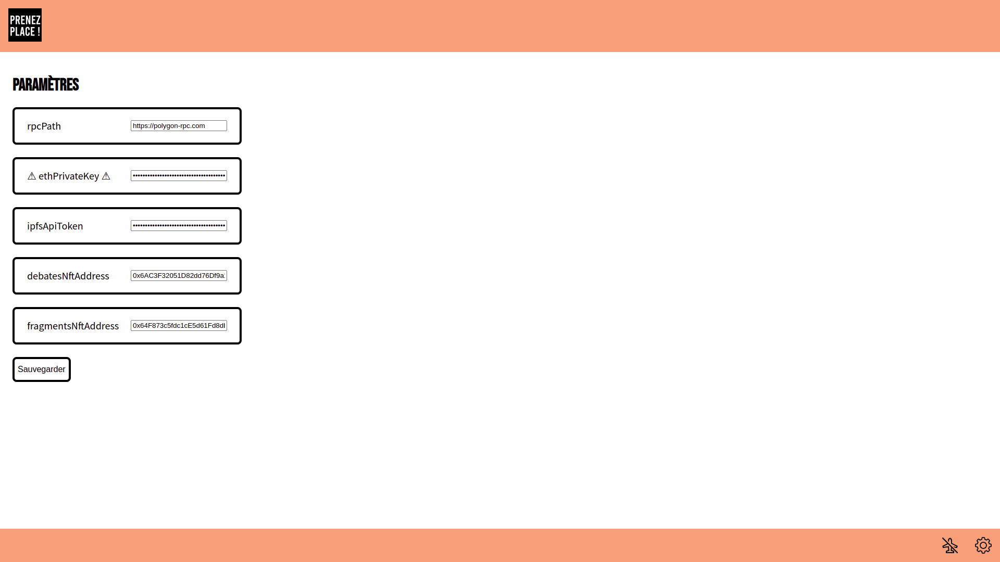

# Blockchain module for *Prenez Place ! / Summer 2022 Tour*

> 🇫🇷 *Une documentation en français est également [disponible](./README-fr.md).*

## About *Prenez Place !*

> 🌐 [prenez-place.fr](https://prenez-place.fr/)

### B-side of *Prenez Place !*

Since 2021, [*Prenez Place !*](https://prenez-place.fr/) has been questioning the subjects of Money, Commons and
Democracy through debates conceived as an artistic, scientific and civic gesture.

Invoking by nature a collective intelligence and a multidisciplinary approach, the project initiates a new phase in the
summer of 2022: the B side.

The B side, in its nomadic, open form, is a series of itinerant debates-performances that will take place,
initially, this summer 2022, on squares, marketplaces, parking lots, in hospitals, train stations, forests,
public/private/open places.

These debates-performances will integrate installations, dance, music, singing,... and a Blockchain module.

### Role of Blockchain in the project

The objectives are numerous. To turn the citizen debate into an object and an artistic act. To bring out a new
democratic space, a new form of agora, of human deliberation. To go beyond the systematic ranking of speech
with the help of a more decentralized network of voices, supporting the emergence of deliberation. To make alive the
possibility of another weave, the possibility of another understanding and other practices of democracy and therefore of
our relationships with others, with other species of living beings.

Blockchain and Web3 technologies, open and decentralized, question in themselves the subjects of Money,
Commons and Democracy. In *Prenez Place !* we also use them as a support for an incremental and indelible
memory of the deliberations. A collective narrative is constructed from the conjunction of the debates-performances and
builds its own memory.

### NFT Collections

Audio recordings of these debates - in their entirety, as well as sectioned into fragments - are made
available on these networks, as collections of non-fungible tokens (NFT). Time-stamped, certified,
an unfalsifiable link unites these records and supports the creation of an open narrative.

### Incandescent tokens, creators of the Commons

While these NFTs exist as such, they can never be owned. After their creation, any purchase or transfer will
necessarily burn the token. This rule is written into the smart contract by allowing the transfer of a token only to an
address that no one controls. Thus, each token is burnt on the Blockchain as a last performative gesture of creation of
a Common.

### Weaving device linked to the blockchain

During the debates-performances, a unique weaving is also made using a Jacquard loom. A piece of
information present on the blockchain and uniquely identifying each debate is used as a random seed to design a unique
punch card, thus responsible for a fragment of the tapestry.

## Functionalities and how-to

## Technical architecture of the module

This project uses various Web3 technologies, following a general approach that can be described as [*Protocols, Not
Platforms*](https://knightcolumbia.org/content/protocols-not-platforms-a-technological-approach-to-free-speech).
Indeed, the solution interacts directly with decentralized networks - for storage or certification
for example - without ever requiring a central server.

- The NFT contract used is formally compatible with the [ERC-721](https://erc721.org/) standard in its
  interface. It has been edited among other things to make the tokens burnable, creator of Common.
- The [_InterPlanetary File System_ (IPFS)](https://ipfs.io/) allows to store and exchange the metadata
  associated to the tokens -
  audio recordings, visualizations,...
- The [Filecoin](https://filecoin.io/) blockchain _via_ the [NFT.Storage](https://nft.storage/) service ensures
  the permanence of the storage and the availability of this data.
- Another smart contract is used as a simpler _Store_ to logically centralize a list of keywords to be
  recognized during the debates.
- Different _sub-graphs_ on [TheGraph](https://thegraph.com/en/) have been developed to index and facilitate the
  exploration of the information thus stored
  on the blockchain.
- Finally, a graphical client has been developed to assist in the recording of debates and the automatic creation
  of new tokens.

Below we expose with more details the main features of this graphical client. 👇

### Recording debates

By clicking on _Start a new debate_, the initialization starts.
We start by declaring the location of the day's debate.

When the rest of the device, including audio configuration, is ready, click on the button _Start Debate_ to start
recording.

During performance, the screen allows on-the-fly, when keywords are spoken, to create audio fragments .
In practice, if the keyword _decentralization_ is spoken during the debate, for example, one just has to click on the
icon
next to the word _decentralization_ in the list - one may use the text search field to find it - and an audio clip of
the few seconds before the click is recorded.

When the debate is over, click on _End debate_ - you will be asked to confirm - to close the recording of the entire
debate.

### History of Debates

The _History of Debates_ button logically allows to explore all past debates.

### Keywords and fragments

Finally, the last entry of the main screen allows to edit the list of keywords that will be accessible during the
recording.

### Settings

At the bottom right of the screen, a button allows to access the settings of the application.

|                       | Description                                                                                                                      | Exemple                                      |
|-----------------------|----------------------------------------------------------------------------------------------------------------------------------|----------------------------------------------|
| `rpcPath`             | RPC endpoint of the blockchain hosting the NFT contracts.                                                                        | `https://polygon-rpc.com`                    |
| `ethPrivateKey`       | Private key to create NFTs. It must control the collections used  and have enough ether to support the transaction fees. | `0x0000..0000dead`                           |
| `ipfsApiToken`        | API token for NFT.Storage service.                                                                                               | `xxx.yyy.zzz`                                |
| `debatesNftAddress`   | Address of the smart contract for debates' NFTs.                                                                                 | `0x6AC3F32051D82dd76Df9a1C1C6db44b549135b86` |
| `fragmentsNftAddress` | Address of the smart contract for fragments' NFTs.                                                                               | `0x64F873c5fdc1cE5d61Fd8db2c0d37894C88f1349` |

